# Cloud-Native Spring Boot Application Deployment on AWS ECS using Terraform, Docker & GitHub Actions

---

## Developed By

### **SHUBHEK KUMAR**

**DevOps Engineer | Cloud & Infrastructure Enthusiast**

B.Tech in Computer Science & Engineering

Sagar Institute of Science & Technology (SISTec), Bhopal

---

### Contact Information

**Email: [Shubhekkumar@gmail.com](mailto:Shubhekkumar@gmail.com)** 

**GitHub:** https://github.com/shubhekkumar/Spring_Boot_appN_Deployment-

**LinkedIn:** https://www.linkedin.com/in/shubhekkumar/

# Project Description

## Overview

**TaskMaster** is a cloud-native Task Management application built with **Spring Boot** and deployed on **Amazon Web Services (AWS)** using a complete DevOps workflow. The project demonstrates modern DevOps practices by automating infrastructure provisioning, application containerization, continuous integration, continuous deployment, and monitoring.

The application allows users to create, update, view, and delete tasks through a simple web interface. Rather than deploying manually, the entire infrastructure is provisioned using **Terraform**, the application is containerized using **Docker**, stored in **Amazon Elastic Container Registry (ECR)**, and deployed on **Amazon ECS Fargate** through an automated **GitHub Actions CI/CD pipeline**.

The project follows Infrastructure as Code (IaC) principles, making the deployment reproducible, scalable, and version-controlled. Logs generated by the application are centralized in **Amazon CloudWatch**, while Terraform state is securely managed using a remote backend with **Amazon S3** and **DynamoDB state locking**.

This project reflects a production-oriented deployment strategy that minimizes manual effort, ensures consistency across environments, and demonstrates industry-standard DevOps practices.

---

## Objectives

The primary objectives of this project are:

- Develop a production-ready Spring Boot Task Management application.
- Containerize the application using Docker multi-stage builds.
- Provision AWS infrastructure using Terraform modules.
- Store Docker images securely in Amazon ECR.
- Deploy the application on Amazon ECS Fargate.
- Automate build, infrastructure provisioning, and deployment using GitHub Actions.
- Centralize application logs using Amazon CloudWatch.
- Securely manage Terraform state using Amazon S3 and DynamoDB.
- Demonstrate a complete end-to-end DevOps CI/CD workflow.

---

## Key Features

- CRUD operations for task management.
- Fully containerized Spring Boot application.
- Infrastructure managed using Terraform (IaC).
- Automated CI/CD pipeline using GitHub Actions.
- Amazon ECS Fargate serverless container deployment.
- Docker image management with Amazon ECR.
- Centralized logging using Amazon CloudWatch.
- Secure IAM Roles and Security Groups.
- Remote Terraform backend using Amazon S3 and DynamoDB.
- Modular and reusable Terraform code.

---

## Technology Stack

| Category | Technology |
| --- | --- |
| Programming Language | Java 17 |
| Framework | Spring Boot |
| Build Tool | Gradle |
| Frontend | HTML, CSS, JavaScript |
| Containerization | Docker |
| Infrastructure as Code | Terraform |
| Cloud Platform | Amazon Web Services (AWS) |
| Container Registry | Amazon Elastic Container Registry (ECR) |
| Container Orchestration | Amazon ECS Fargate |
| CI/CD | GitHub Actions |
| Monitoring & Logging | Amazon CloudWatch |
| State Management | Amazon S3 |
| State Locking | Amazon DynamoDB |
| Version Control | Git & GitHub |

---

# 2. System Architecture

## Architecture Overview

The TaskMaster application follows a cloud-native, containerized deployment architecture built on AWS. The complete software delivery lifecycle is automated using GitHub Actions and Terraform. Developers push code changes to GitHub, triggering an automated CI/CD pipeline that builds the application, creates a Docker image, pushes it to Amazon ECR, provisions or updates infrastructure using Terraform, and deploys the latest container to Amazon ECS Fargate.

The application runs inside a Docker container on ECS Fargate without requiring server management. Infrastructure resources such as the VPC, Subnet, Internet Gateway, IAM Roles, Security Groups, ECS Cluster, CloudWatch Log Group, and ECR Repository are provisioned through Terraform modules. Application logs are collected by Amazon CloudWatch, while Terraform state is securely stored in Amazon S3 with DynamoDB providing state locking to prevent concurrent modifications.

This architecture ensures scalability, repeatability, security, and automated deployments while following Infrastructure as Code (IaC) and DevOps best practices.

---

# Architecture Workflow

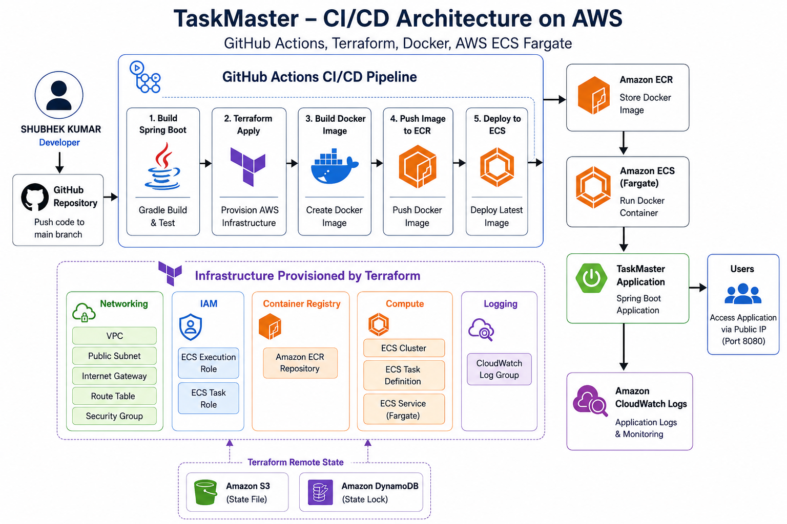

---

# Components Used

| Component | Purpose |
| --- | --- |
| GitHub | Stores application source code |
| GitHub Actions | Automates CI/CD pipeline |
| Gradle | Builds the Spring Boot project |
| Docker | Containerizes the application |
| Amazon ECR | Stores Docker images |
| Terraform | Provisions AWS infrastructure |
| Amazon VPC | Provides network isolation |
| Public Subnet | Hosts ECS networking |
| Internet Gateway | Enables internet connectivity |
| Security Group | Controls inbound and outbound traffic |
| IAM Roles | Grants ECS required permissions |
| Amazon ECS Fargate | Runs the application container |
| Amazon CloudWatch | Collects application logs |
| Amazon S3 | Stores Terraform remote state |
| Amazon DynamoDB | Provides Terraform state locking |

---

# Deployment Flow

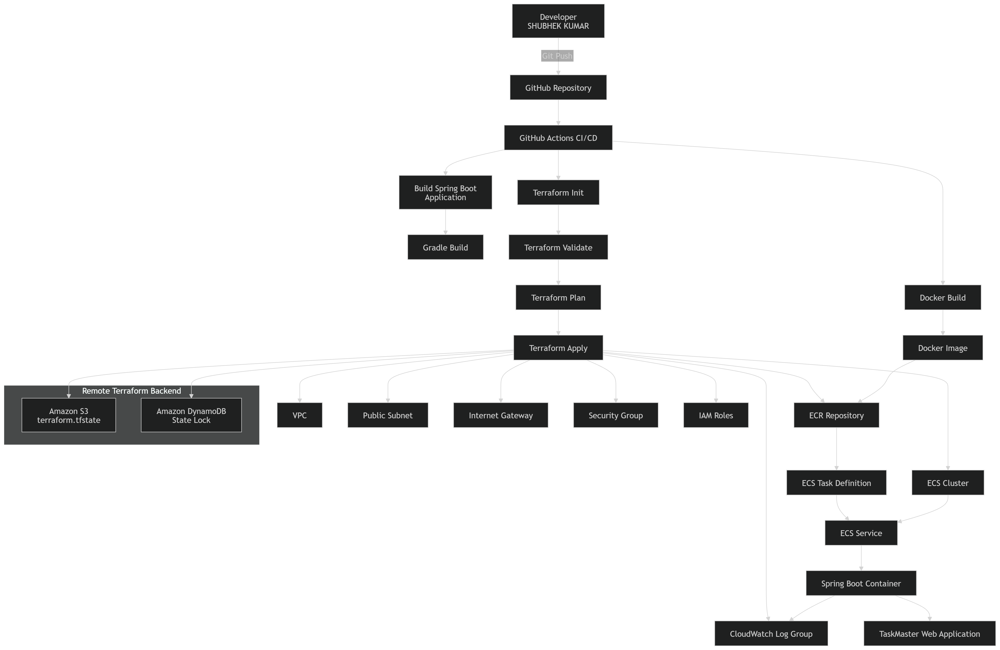

### Step 1

Developer pushes source code to the GitHub repository.

↓

### Step 2

GitHub Actions automatically starts the CI/CD workflow.

↓

### Step 3

Gradle compiles the Spring Boot application and generates the executable JAR.

↓

### Step 4

Docker builds a multi-stage container image.

↓

### Step 5

The Docker image is pushed to Amazon Elastic Container Registry (ECR).

↓

### Step 6

Terraform provisions or updates AWS infrastructure including:

- VPC
- Public Subnet
- Internet Gateway
- Route Table
- Security Group
- IAM Roles
- ECS Cluster
- CloudWatch Log Group
- ECR Repository

↓

### Step 7

Amazon ECS Fargate pulls the latest Docker image from Amazon ECR.

↓

### Step 8

The latest application version is deployed automatically.

↓

### Step 9

Application logs are streamed to Amazon CloudWatch.

↓

### Step 10

Terraform stores its state file in Amazon S3 and uses DynamoDB for state locking, ensuring safe and consistent infrastructure management.

---

# 3. Project Structure

The project follows a modular structure that separates application source code, infrastructure, containerization, documentation, monitoring, and CI/CD configuration. This organization improves maintainability, scalability, and simplifies deployment.

## Overall Project Structure

```
shubheksam@SAM:~/Projects/Spring_Boot_Application_Deployment/Spring_Boot_appN_Deployment-$ tree
.
├── HELP.md
├── PROJECT_TRACKER.md
├── README.md
├── build
│   ├── classes
│   │   └── java
│   │       └── main
│   │           └── com
│   │               └── taskmaster
│   │                   ├── TaskmasterApplication.class
│   │                   ├── controller
│   │                   │   ├── HealthController.class
│   │                   │   └── TaskController.class
│   │                   ├── dto
│   │                   │   └── ErrorResponse.class
│   │                   ├── exception
│   │                   │   ├── GlobalExceptionHandler.class
│   │                   │   └── TaskNotFoundException.class
│   │                   ├── model
│   │                   │   └── Task.class
│   │                   ├── repository
│   │                   │   └── TaskRepository.class
│   │                   └── service
│   │                       └── TaskService.class
│   ├── generated
│   │   └── sources
│   │       ├── annotationProcessor
│   │       │   └── java
│   │       │       └── main
│   │       └── headers
│   │           └── java
│   │               └── main
│   ├── libs
│   │   ├── taskmaster-0.0.1-SNAPSHOT-plain.jar
│   │   └── taskmaster-0.0.1-SNAPSHOT.jar
│   ├── resolvedMainClassName
│   ├── resources
│   │   └── main
│   │       ├── application.properties
│   │       └── static
│   │           ├── css
│   │           │   └── style.css
│   │           ├── index.html
│   │           └── js
│   │               └── app.js
│   └── tmp
│       ├── bootJar
│       │   └── MANIFEST.MF
│       ├── compileJava
│       │   └── previous-compilation-data.bin
│       └── jar
│           └── MANIFEST.MF
├── build.gradle
├── docker
│   └── Dockerfile
├── docs
│   ├── architecture.md
│   ├── deployment.md
│   └── setup.md
├── gradle
│   └── wrapper
│       ├── gradle-wrapper.jar
│       └── gradle-wrapper.properties
├── gradlew
├── gradlew.bat
├── images
│   ├── dto2.webp
│   ├── dtoimage.jpg
│   ├── dtosequencediagram.webp
│   ├── package_by_feature.png
│   └── package_by_layer.png
├── monitoring
│   └── grafana
├── pom.xml
├── settings.gradle
├── src
│   ├── main
│   │   ├── java
│   │   │   └── com
│   │   │       └── taskmaster
│   │   │           ├── TaskmasterApplication.java
│   │   │           ├── config
│   │   │           ├── controller
│   │   │           │   ├── HealthController.java
│   │   │           │   └── TaskController.java
│   │   │           ├── dto
│   │   │           │   └── ErrorResponse.java
│   │   │           ├── exception
│   │   │           │   ├── GlobalExceptionHandler.java
│   │   │           │   └── TaskNotFoundException.java
│   │   │           ├── model
│   │   │           │   └── Task.java
│   │   │           ├── repository
│   │   │           │   └── TaskRepository.java
│   │   │           └── service
│   │   │               └── TaskService.java
│   │   └── resources
│   │       ├── application.properties
│   │       └── static
│   │           ├── css
│   │           │   └── style.css
│   │           ├── index.html
│   │           └── js
│   │               └── app.js
│   └── test
│       └── java
│           └── com
│               └── taskmaster
└── terraform
    ├── backend.tf
    ├── environments
    │   └── dev
    ├── main.tf
    ├── modules
    │   ├── cloudwatch
    │   │   ├── main.tf
    │   │   ├── outputs.tf
    │   │   └── variables.tf
    │   ├── ecr
    │   │   ├── main.tf
    │   │   ├── outputs.tf
    │   │   └── variables.tf
    │   ├── ecs
    │   │   ├── main.tf
    │   │   ├── outputs.tf
    │   │   └── variables.tf
    │   ├── iam
    │   │   ├── main.tf
    │   │   ├── outputs.tf
    │   │   └── variables.tf
    │   ├── network
    │   │   ├── main.tf
    │   │   ├── outputs.tf
    │   │   └── variables.tf
    │   └── security
    │       ├── main.tf
    │       ├── outputs.tf
    │       └── variables.tf
    ├── output.tf
    ├── provider.tf
    ├── terraform.tfstate
    ├── terraform.tfstate.backup
    ├── variables.tf
    └── versions.tf

68 directories, 77 files
```

---

# Project Directory Description

## 1. src/

The **src** directory contains the complete Spring Boot application source code.

```
src/
├── main/
│   ├── java/
│   └── resources/
└── test/
```

### Purpose

- Business Logic
- REST APIs
- Exception Handling
- DTOs
- Static Web Pages

---

## 2. Java Package Structure

```
com.taskmaster
│
├── controller
├── service
├── repository
├── model
├── dto
├── exception
├── config
└── TaskmasterApplication.java
```

### Package Description

| Package | Description |
| --- | --- |
| controller | Contains REST Controllers that handle HTTP requests and API endpoints. |
| service | Implements the business logic of the TaskMaster application. |
| repository | Handles data access operations and repository layer. |
| model | Defines entity classes used by the application. |
| dto | Contains Data Transfer Objects used between layers. |
| exception | Implements custom exception classes and global exception handling. |
| config | Stores application configuration classes. |
| TaskmasterApplication | Main entry point of the Spring Boot application. |

---

## 3. Resources

```
resources/
│
├── application.properties
└── static/
    ├── css/
    ├── js/
    └── index.html
```

### Description

| Resource | Purpose |
| --- | --- |
| application.properties | Stores Spring Boot application configuration. |
| static/css | Contains application stylesheets. |
| static/js | Contains client-side JavaScript files. |
| index.html | Main user interface of the TaskMaster application. |

---

## 4. Docker

```
docker/
└── Dockerfile
```

### Purpose

The Docker directory contains the Dockerfile used to package the Spring Boot application into a lightweight container image.

The Docker image is built automatically during the GitHub Actions pipeline and pushed to Amazon Elastic Container Registry (ECR).

---

## 5. Terraform

```
terraform/
│
├── backend.tf
├── provider.tf
├── versions.tf
├── variables.tf
├── main.tf
├── output.tf
├── environments/
└── modules/
```

### Purpose

The Terraform directory contains Infrastructure as Code (IaC) files responsible for provisioning all AWS resources required for the application deployment.

---

# Terraform Modules

The infrastructure is organized into reusable modules.

```
modules/
│
├── network
├── security
├── iam
├── ecr
├── ecs
└── cloudwatch
```

### Module Description

| Module | Purpose |
| --- | --- |
| Network | Creates the VPC, Public Subnet, Internet Gateway, Route Table, and Route Table Association. |
| Security | Creates the Security Group with inbound and outbound rules. |
| IAM | Creates ECS Task Role and ECS Execution Role with required permissions. |
| ECR | Creates the Amazon Elastic Container Registry (ECR) repository. |
| ECS | Creates the ECS Cluster, Task Definition, and ECS Service. |
| CloudWatch | Creates the CloudWatch Log Group for application logs. |

---

## 6. Documentation

```
docs/
├── architecture.md
├── deployment.md
└── setup.md
```

### Purpose

Stores project documentation, deployment instructions, setup guide, and architecture explanation.

---

## 7. Monitoring

```
monitoring/
└── grafana/
```

### Purpose

Contains monitoring-related configurations prepared for future integration with Grafana dashboards.

---

## 8. Images

```
images/
```

### Purpose

Stores architecture diagrams, UML diagrams, screenshots, and project-related images used in the documentation.

---

## 9. Build Configuration

| File | Description |
| --- | --- |
| build.gradle | Defines project dependencies, plugins, and Gradle build tasks. |
| settings.gradle | Configures the Gradle project settings. |

---

## 10. Documentation Files

| File | Purpose |
| --- | --- |
| README.md | Provides project overview, setup instructions, architecture, and deployment guide. |
| PROJECT_TRACKER.md | Tracks project milestones, completed tasks, and development progress. |
| HELP.md | Contains additional project notes and reference information. |

---

# Project Organization Summary

The project is divided into five major components:

- **Application Layer** – Spring Boot source code implementing the TaskMaster application.
- **Containerization Layer** – Docker configuration for packaging the application.
- **Infrastructure Layer** – Terraform modules that provision AWS infrastructure.
- **Automation Layer** – GitHub Actions workflow for CI/CD automation.
- **Documentation Layer** – Guides, architecture documents, and deployment instructions.

This modular structure follows industry-standard software engineering and DevOps practices, making the project easy to maintain, extend, and deploy across different environments.

---

# 4. Infrastructure Provisioning using Terraform

## Overview

Infrastructure provisioning for the TaskMaster application is fully automated using **Terraform**, an Infrastructure as Code (IaC) tool. Instead of manually creating AWS resources through the AWS Management Console, all infrastructure components are defined in reusable Terraform modules. This approach ensures consistency, repeatability, and version-controlled infrastructure management.

The Terraform configuration provisions all resources required to deploy the Spring Boot application on AWS ECS Fargate.

---

# Terraform Architecture

```
                                    Terraform
                                       │                                
                                       ▼
                                Main Configuration
                                       │
      ├──────────────┬──────────────┬─────────────┬────────────┬─────────────┐
      ▼              ▼              ▼             ▼             ▼            ▼
 Network        Security        IAM          ECR        CloudWatch          ECS
 
    
```

---

# Terraform Modules

The infrastructure is organized into six reusable modules.

---

## 1. Network Module

The Network module provisions the networking infrastructure required by the application.

### Resources Created

- Amazon VPC
- Public Subnet
- Internet Gateway
- Route Table
- Route Table Association

### Purpose

The VPC provides an isolated network for the application. A public subnet allows the ECS task to receive a public IP address, while the Internet Gateway and Route Table enable internet connectivity.

---

## 2. Security Module

The Security module creates a Security Group to control inbound and outbound network traffic.

### Inbound Rules

| Port | Protocol | Purpose |
| --- | --- | --- |
| 80 | TCP | HTTP |
| 443 | TCP | HTTPS |
| 8080 | TCP | Spring Boot Application |

### Outbound Rules

- Allow all outbound traffic.

### Purpose

The Security Group ensures that users can access the Spring Boot application while allowing the container to communicate with required AWS services.

---

## 3. IAM Module

The IAM module creates the required IAM roles for Amazon ECS.

### Resources Created

- ECS Task Execution Role
- ECS Task Role
- ECS Execution Policy Attachment

### Purpose

The Execution Role allows ECS to pull Docker images from Amazon ECR and send logs to Amazon CloudWatch. The Task Role is assigned to the running container for future application permissions.

---

## 4. Amazon ECR Module

The ECR module provisions a private Docker image repository.

### Resources Created

- Amazon Elastic Container Registry Repository

### Purpose

The Docker image built during the GitHub Actions workflow is pushed to this repository. Amazon ECS pulls the latest image from ECR during deployment.

---

## 5. Amazon ECS Module

The ECS module provisions the compute environment for the application.

### Resources Created

- ECS Cluster
- ECS Task Definition
- ECS Service

### Purpose

The ECS Cluster provides the execution environment, the Task Definition defines the container configuration, and the ECS Service ensures the required number of running tasks.

---

## 6. CloudWatch Module

The CloudWatch module creates a Log Group for centralized application logging.

### Resources Created

- CloudWatch Log Group

### Purpose

Spring Boot application logs generated by the ECS container are automatically collected and stored in Amazon CloudWatch Logs for monitoring and troubleshooting.

---

# Remote Terraform Backend

Terraform state management is configured using an AWS remote backend.

### Components Used

| AWS Service | Purpose |
| --- | --- |
| Amazon S3 | Stores the Terraform state file (`terraform.tfstate`) |
| Amazon DynamoDB | Provides state locking to prevent concurrent infrastructure modifications |

### Benefits

- Centralized state management
- Team collaboration
- State locking
- Improved reliability
- Version-controlled infrastructure state

---

# Infrastructure Deployment Workflow

```
Terraform Init
        │
        ▼
Terraform Validate
        │
        ▼
Terraform Plan
        │
        ▼
Terraform Apply
        │
        ▼
AWS Infrastructure Created
        │
        ├── VPC
        ├── Security Group
        ├── IAM Roles
        ├── ECR Repository
        ├── ECS Cluster
        ├── CloudWatch Log Group
        └── ECS Service
```

---

# Benefits of Using Terraform

- Infrastructure as Code (IaC)
- Automated resource provisioning
- Reusable modular architecture
- Version-controlled infrastructure
- Consistent deployments
- Easy infrastructure destruction using `terraform destroy`
- Remote state management using Amazon S3
- State locking using DynamoDB

---

# 5. CI/CD Pipeline using GitHub Actions

## Overview

A Continuous Integration and Continuous Deployment (CI/CD) pipeline was implemented using **GitHub Actions** to automate the complete deployment process of the TaskMaster application. Every push to the **main** branch automatically triggers the workflow, eliminating the need for manual deployment.

The pipeline performs application build, infrastructure provisioning, Docker image creation, image publishing to Amazon ECR, and deployment to Amazon ECS Fargate.

This automation ensures consistent deployments, reduces manual effort, and enables rapid software delivery.

---

# CI/CD Workflow

```
Developer
      │
      ▼
Git Push (main branch)
      │
      ▼
GitHub Actions
      │
      ▼
Build Spring Boot Application
      │
      ▼
Terraform Infrastructure Provisioning
      │
      ▼
Build Docker Image
      │
      ▼
Push Image to Amazon ECR
      │
      ▼
Deploy to Amazon ECS
      │
      ▼
Application Running
```

---

# Pipeline Stages

The workflow is divided into four jobs executed sequentially.

---

## Stage 1 – Build Application

The first stage checks out the source code and builds the Spring Boot application.

### Tasks Performed

- Checkout source code
- Install Java 17
- Grant Gradle execution permission
- Build the application using Gradle

### Commands Executed

```bash
chmod +x gradlew

./gradlew clean build
```

### Output

- Spring Boot application compiled successfully.
- Executable JAR file generated.

---

## Stage 2 – Infrastructure Provisioning

The second stage provisions AWS infrastructure using Terraform.

### Tasks Performed

- Configure AWS credentials
- Initialize Terraform
- Validate configuration
- Generate execution plan
- Apply infrastructure changes

### Commands Executed

```bash
terraform init

terraform validate

terraform plan

terraform apply
```

### AWS Resources Created

- VPC
- Public Subnet
- Internet Gateway
- Route Table
- Security Group
- IAM Roles
- Amazon ECR Repository
- ECS Cluster
- ECS Task Definition
- ECS Service
- CloudWatch Log Group

---

## Stage 3 – Docker Image Build & Push

After infrastructure provisioning, the application is containerized and uploaded to Amazon ECR.

### Tasks Performed

- Login to Amazon ECR
- Build Docker image
- Tag Docker image
- Push Docker image

### Commands Executed

```bash
docker build

docker tag

docker push
```

### Output

The latest Docker image is successfully stored in Amazon Elastic Container Registry (ECR).

---

## Stage 4 – Application Deployment

The final stage deploys the Docker image to Amazon ECS.

### Tasks Performed

- Update ECS Service
- Force new deployment
- Wait until ECS service becomes stable

### AWS CLI Commands

```bash
aws ecs update-service

aws ecs wait services-stable
```

### Output

- ECS pulls the latest Docker image from Amazon ECR.
- A new container is launched.
- The TaskMaster application becomes available through the ECS public IP.

---

# GitHub Actions Workflow Sequence

```
Git Push
     │
     ▼
Checkout Repository
     │
     ▼
Build Spring Boot
     │
     ▼
Terraform Apply
     │
     ▼
Docker Build
     │
     ▼
Push Image to Amazon ECR
     │
     ▼
Deploy to Amazon ECS
     │
     ▼
Running Application
```

---

# Benefits of the CI/CD Pipeline

- Fully automated deployment process
- Eliminates manual infrastructure provisioning
- Consistent and repeatable deployments
- Faster application delivery
- Reduced deployment errors
- Version-controlled deployment workflow
- Simplified infrastructure management
- Easy integration with GitHub repositories

---

# Pipeline Execution Result

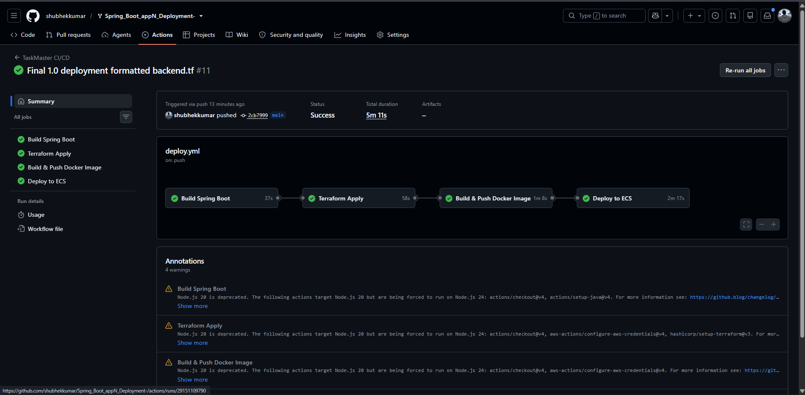

The CI/CD pipeline was successfully executed using GitHub Actions.

The workflow completed the following tasks without manual intervention:

- Successfully built the Spring Boot application.
- Provisioned AWS infrastructure using Terraform.
- Built the Docker image.
- Pushed the image to Amazon ECR.
- Deployed the application to Amazon ECS Fargate.
- Verified successful deployment with a running ECS service and accessible application.

---

This section documents the complete CI/CD implementation that you built and demonstrated through GitHub Actions.

---

# 6. Deployment Verification and Results

## Overview

After executing the GitHub Actions CI/CD pipeline, the deployment was verified through various AWS services and application testing. Each stage of the deployment was successfully completed, confirming that the infrastructure was provisioned correctly, the Docker image was deployed, and the Spring Boot application was running successfully on Amazon ECS Fargate.

---

# 6.1 GitHub Actions Pipeline

**Description**

The GitHub Actions workflow successfully completed all stages of the CI/CD pipeline. The workflow automatically built the application, provisioned AWS infrastructure, created the Docker image, pushed it to Amazon ECR, and deployed the application to Amazon ECS.

**Screenshot**


**Result**

- Spring Boot application built successfully.
- Terraform executed successfully.
- Docker image pushed to Amazon ECR.
- ECS deployment completed successfully.

---

# 6.2 Terraform Infrastructure

**Description**

Terraform successfully provisioned all AWS resources required for the deployment.

**Resources Created**

- Amazon VPC
- Public Subnet
- Internet Gateway
- Route Table
- Security Group
- IAM Roles
- Amazon ECR Repository
- Amazon ECS Cluster
- ECS Task Definition
- ECS Service
- CloudWatch Log Group

**Screenshot**

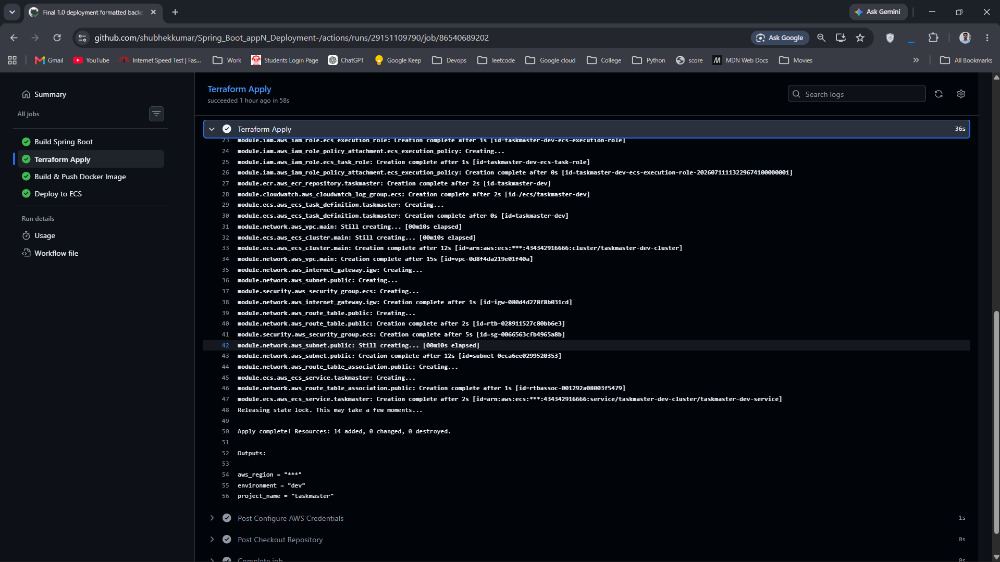

---

# 6.3 Amazon ECS Deployment

**Description**

The application was successfully deployed to Amazon ECS Fargate.

The ECS Service launched the container and maintained the required running task.

**Verification**

- ECS Cluster Status: Active
- ECS Service Status: Active
- Running Tasks: 1
- Desired Tasks: 1

**Screenshot**

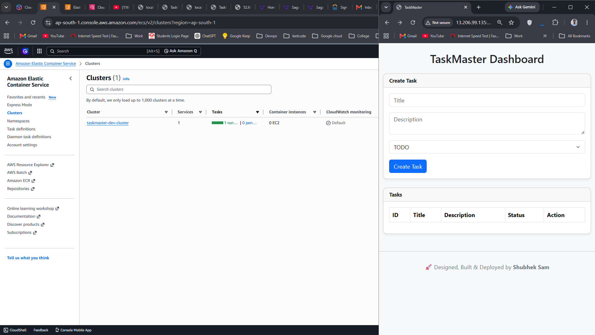

---

# 6.4 Docker Image in Amazon ECR

**Description**

The Docker image generated during the GitHub Actions workflow was successfully uploaded to Amazon Elastic Container Registry (ECR).

**Verification**

- Repository Created
- Latest Image Available
- Push Completed Successfully

**Screenshot**

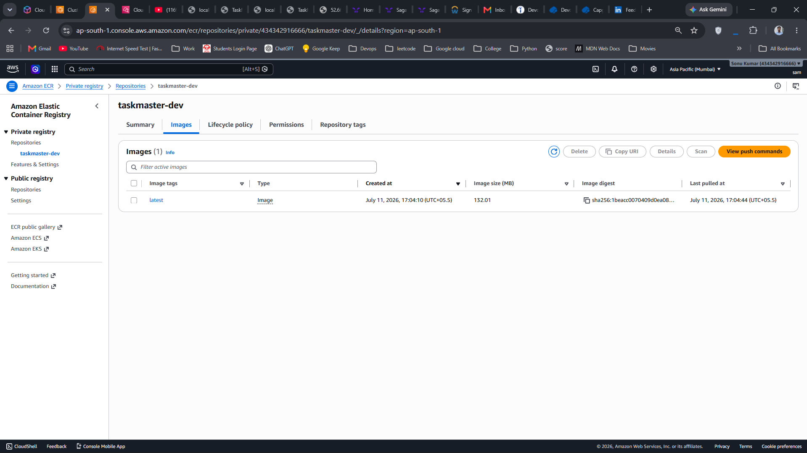

---

# 6.5 Application Execution

**Description**

The TaskMaster application was successfully launched inside an Amazon ECS Fargate container.

The application was accessed using the public IP assigned to the running ECS task.

**Verification**

- Application Started Successfully
- REST APIs Accessible
- Web Interface Loaded Successfully

**Screenshot**

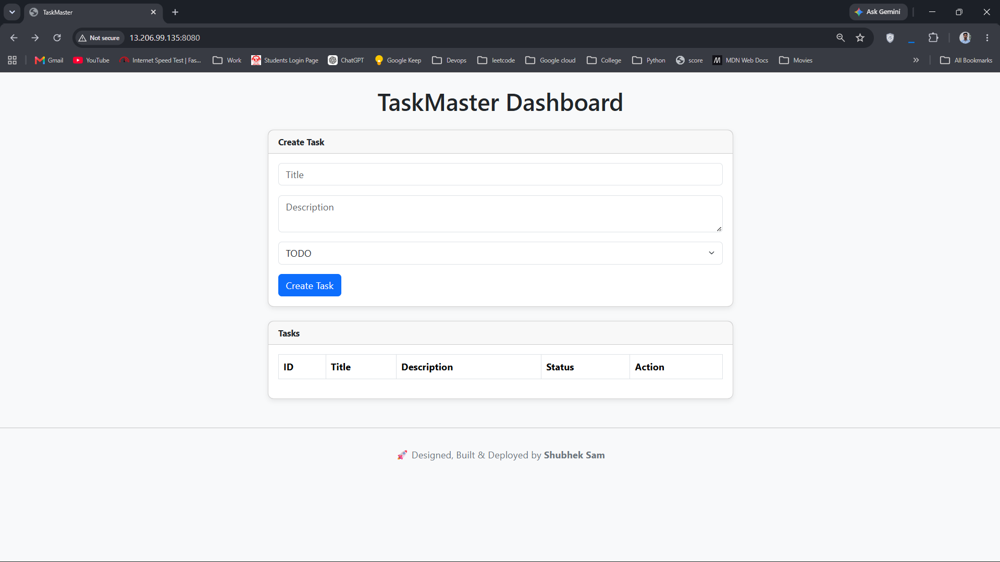

---

# 6.6 CloudWatch Logging

**Description**

Application logs generated by the Spring Boot container were automatically collected and stored in Amazon CloudWatch.

These logs provide centralized monitoring and simplify troubleshooting.

**Verification**

- Log Group Created
- Application Logs Generated
- Spring Boot Startup Logs Available

**Screenshot**

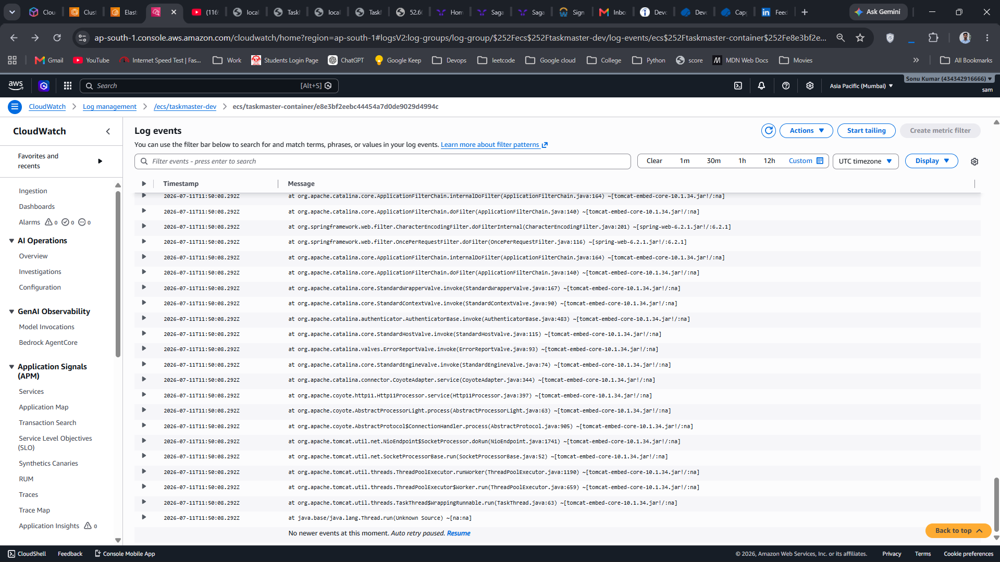

---

# 6.7 Terraform Remote Backend

**Description**

Terraform state was stored remotely in Amazon S3 while DynamoDB provided state locking to prevent concurrent modifications.

This ensured reliable and collaborative infrastructure management.

**Verification**

- Remote State Stored in Amazon S3
- State Locking Configured Using DynamoDB

**Screenshots**

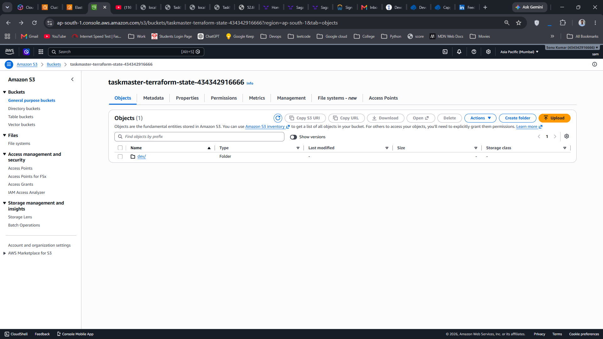

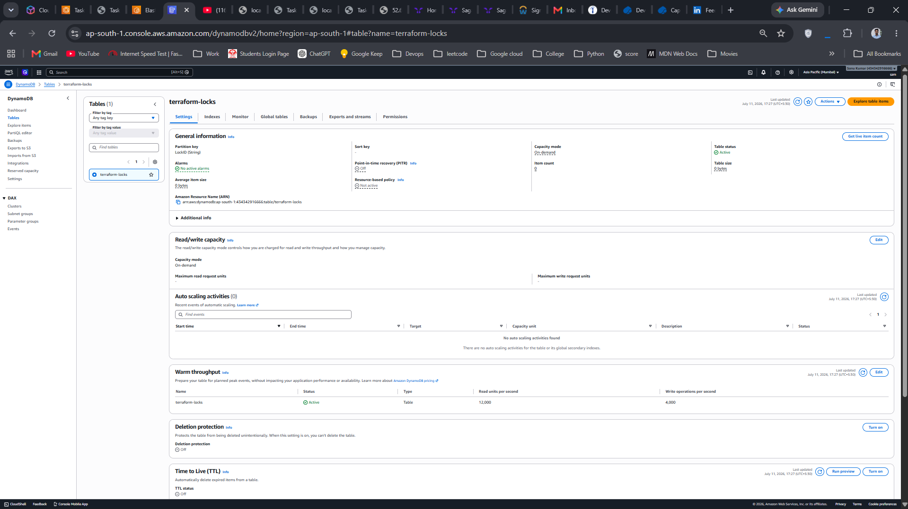

---

# 6.8 AWS VPC  Structure

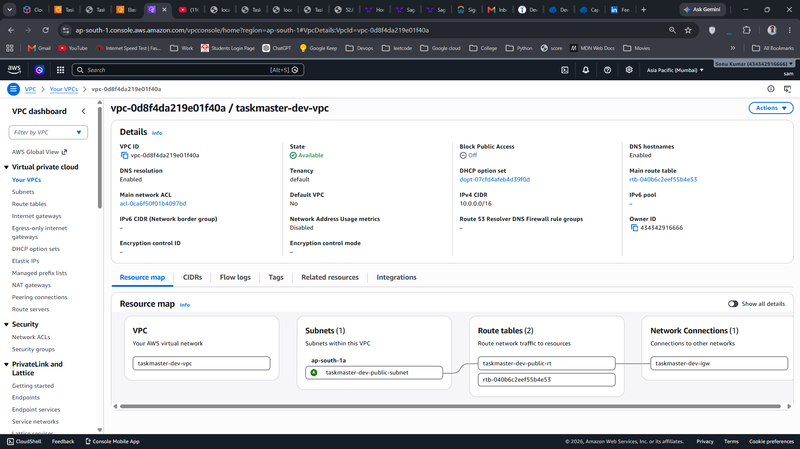

# 6.9 Infrastructure Cleanup

**Description**

After successful deployment and verification, all AWS resources were removed using Terraform.

The Terraform backend resources were also deleted manually to avoid unnecessary AWS charges.

**Cleanup Activities**

- Terraform Destroy Executed
- ECS Cluster Removed
- ECR Repository Removed
- CloudWatch Log Group Removed
- VPC and Networking Resources Removed
- Amazon S3 Backend Bucket Deleted
- DynamoDB Lock Table Deleted

**Screenshot**

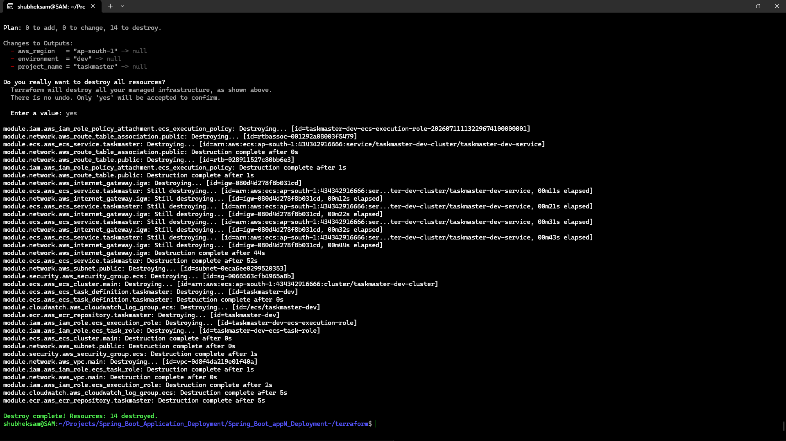

## 

---

# Deployment Summary

| Verification Item | Status |
| --- | --- |
| Spring Boot Build | ✅ Successful |
| Terraform Provisioning | ✅ Successful |
| Docker Image Build | ✅ Successful |
| Amazon ECR Push | ✅ Successful |
| ECS Cluster Creation | ✅ Successful |
| ECS Service Deployment | ✅ Successful |
| Application Running | ✅ Successful |
| CloudWatch Logging | ✅ Successful |
| Remote Terraform State | ✅ Successful |
| Infrastructure Cleanup | ✅ Successful |

---

# Project Outcome

The TaskMaster application was successfully deployed using a fully automated CI/CD pipeline. Infrastructure provisioning, containerization, deployment, logging, and cleanup were completed without manual resource configuration.

The project demonstrates practical implementation of Infrastructure as Code (IaC), Continuous Integration, Continuous Deployment, Docker containerization, and AWS cloud services. It showcases a complete DevOps workflow suitable for production-oriented deployment practices.

---
